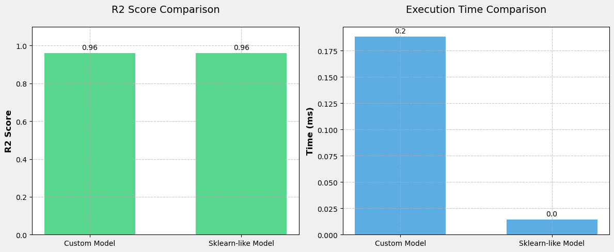

# Lab 3: Naive Bayes Classifier

## Dataset

The lab uses the ["Mushrooms"](https://www.kaggle.com/datasets/devitachi/mashroom-dataset?resource=download) dataset from kaggle. This dataset includes descriptions of hypothetical samples corresponding to 23 species of gilled mushrooms in the Agaricus and Lepiota families. Each sample is classified as either edible ('e') or poisonous ('p'). The dataset contains 8,124 instances with 22 categorical attributes including features like cap shape, cap surface, cap color, bruises, odor, gill attachment, etc.

## Objective

The main objective of this lab is to implement a Categorical Naive Bayes classifier from scratch and compare its performance with scikit-learn's implementation. This implementation demonstrates the foundational concepts of the Naive Bayes algorithm, including:

1. Prior probability calculation
2. Conditional probability estimation with Laplace smoothing
3. Log-probability addition for numerical stability

## Implementation

The implementation consists of two main components:

1. **Custom Naive Bayes Implementation**: Located in `source/naive_bayes.py`, this implementation includes:
   - A `CategoricalNB` class that handles categorical features
   - `fit()` method to train the model on the training data
   - `predict()` method that uses Bayes' theorem to classify new instances

2. **Evaluation Notebook**: Located in `source/run.ipynb`, this notebook:
   - Loads and preprocesses the mushroom dataset
   - Trains both the custom implementation and scikit-learn's CategoricalNB
   - Compares the performance of both implementations

## Methodology

1. **Data Preprocessing**:
   - The categorical features are encoded using scikit-learn's OrdinalEncoder
   - The target variable is mapped from {'e', 'p'} to {0, 1}
   - The dataset is split into 80% training and 20% testing sets

2. **Model Training and Evaluation**:
   - Both implementations are trained on the same training set
   - Performance is measured using standard metrics (accuracy, precision, recall, F1-score)
   - Execution time is compared between the two implementations
   - Cross-validation is used to ensure robust performance evaluation

## Results

The comparison between the custom implementation and scikit-learn's implementation shows:

1. **Classification Performance**:
   - Both implementations achieve identical accuracy of 95.94%
   - Both models show similar precision and recall patterns across classes

2. **Execution Time**:
   - The sklearn implementation is faster (0.014s vs 0.188s)
   - The custom implementation takes approximately 13x longer to execute

### Comparison Table

| Metric | Custom Implementation | Scikit-learn Implementation |
|--------|----------------------|----------------------------|
| Accuracy | 95.94% | 95.94% |
| Precision (Class 0) | 0.93 | 0.93 |
| Recall (Class 0) | 0.99 | 0.99 |
| F1-score (Class 0) | 0.96 | 0.96 |
| Precision (Class 1) | 0.99 | 0.99 |
| Recall (Class 1) | 0.92 | 0.92 |
| F1-score (Class 1) | 0.96 | 0.96 |
| Execution Time | 0.188s | 0.014s |
| Relative Speed | 1x | ~13x faster |

## Conclusion

The custom implementation successfully achieves the same classification performance as scikit-learn's implementation, demonstrating a thorough understanding of the Naive Bayes algorithm. The performance difference in execution time is expected, as scikit-learn's implementation is highly optimized for performance.

This lab reinforces the understanding of:
- Probability theory in machine learning
- Naive Bayes classification principles
- Implementation considerations such as smoothing and numerical stability
- Categorical data handling in classifiers

